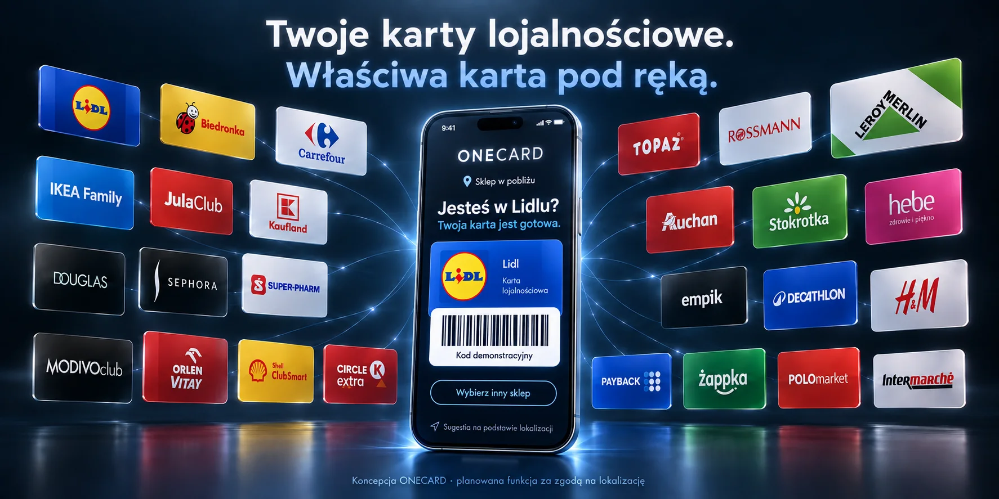

# ONECARD

[Otwórz działającą aplikację](https://spiru1984.github.io/onecard-mvp/)

[Pokaz bez rejestracji i propozycja pilotażu](demo.html) — trzy fikcyjne karty; bez odczytu prywatnego portfela, konta i lokalizacji.

Grafika przedstawia wizję produktu i przykładowe karty, nie listę oficjalnych partnerów ani gwarantowanych integracji. Rzeczywisty interfejs może się różnić od makiety.

## Karta pobliskiego sklepu

Przycisk **Znajdź sklep w pobliżu** pobiera lokalizację dopiero na żądanie i za zgodą użytkownika. Przybliżone współrzędne (zaokrąglone do 3 miejsc po przecinku) trafiają do Overpass API, które zwraca sklepy OpenStreetMap. Kody kart i dane konta nie są wysyłane. Nie zapisujemy historii lokalizacji ani wyników wyszukiwania.

Aplikacja proponuje zapisane karty pasujące nazwą do sklepów w promieniu około 300 m. Użytkownik wybiera właściwą kartę i otwiera jej oryginalny kod. Sugestie wygasają po dwóch minutach, zmianie portfela lub opuszczeniu aplikacji. Wyszukiwanie wymaga internetu; dokładność GPS i kompletność danych sklepowych są ograniczone. Nie ma śledzenia w tle ani automatycznego potwierdzania, że użytkownik znajduje się w konkretnym sklepie. Dane: [© OpenStreetMap contributors](https://www.openstreetmap.org/copyright).

Prosty portfel kart lojalnościowych. Otwórz aplikację przez HTTPS, wybierz **Skanuj**, zezwól na aparat, zeskanuj cały kod i podaj nazwę sklepu. Zapisana karta zachowuje treść oraz format kodu. Można też dodać kartę ręcznie.

Obsługiwane formaty: Code 128, Code 39, EAN-13, EAN-8, UPC-A, QR, Data Matrix, Aztec i PDF417. Stare karty bez pola `format` pozostają w Code 128. Kody dynamiczne nie odświeżają się — dla takich kart używaj aplikacji sklepu.

Po przygotowaniu aplikacji offline można ponownie otwierać aplikację i dodawać lub pokazywać zapisane karty bez internetu. Portfel lokalny pozostaje w tej przeglądarce. Po zalogowaniu e-mailem i hasłem karty konta synchronizują się przez Supabase; zmiany offline czekają na połączenie. Rejestracja wymaga potwierdzenia adresu, a istniejące konto bez hasła może ustawić je w ustawieniach konta. SMS jest jeszcze wyłączony. Usunięcie danych witryny usuwa karty lokalne i niezsychronizowane zmiany. Zwiększ jasność ekranu przy kasie, a długi kod pokaż poziomo.

## Rozwój i testowanie

Statyczna aplikacja bez kompilacji. Uruchom serwer HTTP w katalogu repozytorium, np. `python -m http.server 4173 --bind 127.0.0.1`, i otwórz `http://127.0.0.1:4173`. Aparat działa na localhost lub HTTPS.

Testy akceptacyjne: `npm install`, `npx playwright install chromium`, następnie przy działającym serwerze `npm test`. Opcjonalnie `BROWSER_CHANNEL=msedge` używa zainstalowanego Edge. Testy używają osobnego profilu i sztucznego obrazu przesyłanego jako strumień kamery; nie korzystają z prywatnych kart ani fizycznego aparatu.

Zakres: odczyt zwrotny dziewięciu formatów, dokładne dane i zera wiodące, zapis/odczyt offline, niewłaściwa cyfra kontrolna, odmowa aparatu, zamknięcie przed udzieleniem zgody, zatrzymanie ścieżek, zgodność ze starymi kartami i zachowanie uszkodzonej pamięci. Ostateczny test optyczny wymaga telefonu i czytnika sklepu.

## Biblioteki

Pliki bibliotek są lokalne i objęte cache offline, bez żądań do CDN:
- @zxing/browser 0.1.5 (MIT), zawiera @zxing/library (Apache-2.0): https://github.com/zxing-js/browser
- bwip-js 4.7.0 (MIT), w tym Barcode Writer in Pure PostScript: https://github.com/metafloor/bwip-js

Licencje znajdują się w plikach `*-LICENSE`. Wersja wyjściowa repozytorium: `03389aa110820770b12c694090e37ef468bdc0b5`.

## Import z innych aplikacji i konto

Wybierz **Importuj zdjęcie / zrzut ekranu** i wskaż obraz karty zapisany na telefonie. Dekoder próbuje różne obroty, rozmiary i fragmenty zrzutu. Po odczycie sprawdź numer i format przed zapisaniem. Zdjęcia nie opuszczają urządzenia; import działa również offline. Jeżeli obraz zawiera kilka kodów, przytnij go do właściwej karty. Gdy HEIC nie jest obsługiwany przez przeglądarkę, wybierz PNG/JPG.

Import przenosi kod, a nie konto sklepu: nie pobiera kuponów, salda punktów, paragonów ani zmieniających się kodów. ONECARD nie odczytuje prywatnej zawartości innych aplikacji. Na iPhonie użyj zrzutu ekranu karty i selektora zdjęć w ONECARD.

Logowanie e-mailem i hasłem oraz synchronizacja kart są podłączone do Supabase. Kod e-mail służy do potwierdzenia rejestracji lub odzyskania dostępu. SMS pozostaje wyłączony do czasu konfiguracji dostawcy. Szczegóły konfiguracji i ograniczeń testu: [ACCOUNT-SETUP.md](ACCOUNT-SETUP.md). Biblioteka @supabase/supabase-js 2.115.0 jest dołączona lokalnie (licencja MIT w SUPABASE-LICENSE).

`import-account.test.cjs` sprawdza zdjęcia QR i obrócone kody kreskowe, import offline, błędne pliki, logowanie e-mail/SMS i powiązanie metod, oddzielenie kont, świadomy import kart gościa, ponowienie synchronizacji oraz znaczniki usunięcia. Część kont używa prawdziwego SDK z symulowanymi odpowiedziami HTTP; nie wysyła SMS/e-maili i nie zastępuje testów RLS ani dostarczenia wiadomości na prawdziwym projekcie.
